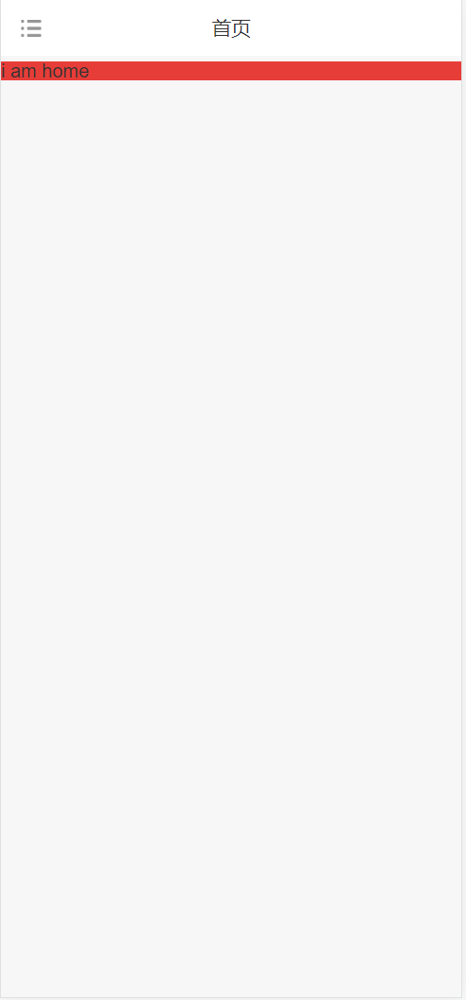

# vue3相关

## 基于vite、vue3、pnpm的脚手架

```
git clone https://gitee.com/chencdashi/vite-vue3-pnpm-cli.git
```
### mobile端 - mobile分支
  1. 截图
  
  
  

  1. 技术栈
  - vue-router
    - 路由守卫
  - vuex
  - tailwind
  - 环境变量
  - vant
    - 导航组件
    - 只读form组件
    - 文件上传组件
  - 登录界面、登录逻辑
  - 部分示例界面
  - axios封装、路由拦截
  - localStorage封装
    - token存取封装(setToken、getToken、removeToken)
  - 工具方法
    - 日期时间转换
    - 文件下载
    - 类型判断

### pc端 - pc分支
